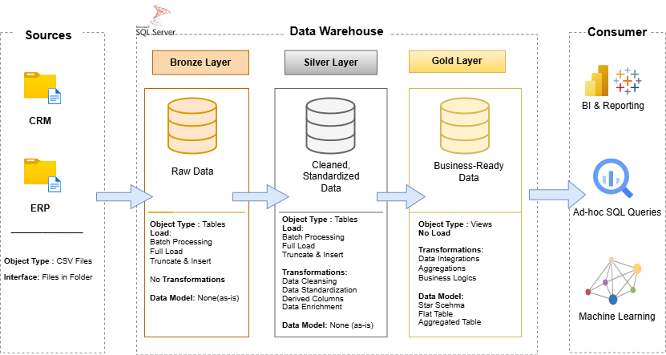

# Data Warehouse and Analytics Project
Building a modernized data warehouse using SQL Server, including ETL processes, data modelling and analytics.

Welcome to the **Data Warehouse and Analytics Project** repository. 
This project demonstrates a comprehensice data warehousing and analytics solution, from building a data warehouse to generating actionable insights. Designed as a portfolo project, it highlights indutry best practices in data enginerring and analytics.

---
## 🏗️ Data Architecture

The data architecture for this project follows Medallion Architecture **Bronze**, **Silver**, and **Gold** layers:


1. **Bronze Layer**: Stores raw data as-is from the source systems. Data is ingested from CSV Files into SQL Server Database.
2. **Silver Layer**: This layer includes data cleansing, standardization, and normalization processes to prepare data for analysis.
3. **Gold Layer**: Houses business-ready data modeled into a star schema required for reporting and analytics.

---

## 📖 Project Overview
This project involves:
1. **Data Architecture:** Designing a modern Data Warehouse using Medallion Architecture **Bronze**, **Silver** and **Gold** layers.
2. **ETL Pipelines:** Extracting, Transforming and Loading data fromo source systems into the warehouse.
3. **Data Modeling:** Developing fact and dimension tables, optimized for analytical queries.
4. **Analytics & Reporting:** Creating SQL-based reports and dashboards for actionable insights.

🎯 This repository is an excellent resource for professionals and students looking to showcase expertise in:
- SQL Development
- Data Architect
- Data Engineering
- ETL Pipeline Developer
- Data Modeling
- Data Analytics
---

## 🛠️ Important Links & Tools:
- **Datasets**: Access to the Project Dataset (csv files).
- **[SQL Server Express](https://www.microsoft.com/en-us/sql-server/sql-server-downloads):** Lightweight server for hosting your SQL database.
- **[GIT Repository](https://github.com/):** Repository to manage, version and collaborate on the code efficiently.
- **[DrawIO](https://www.drawio.com/):**: Design Data Architecture, models, flows and diagrams.
- **[Notion Project Steps](https://www.notion.so/Data-Warehouse-Project-2f6500583853804f9f98fe4eb524b221):** Access to all project phases and tasks.

---

## 🚀 Project Requirements
#### Building the Data Warehouse (Data Engineering)

#### Objective
Develop a modern warehouse using SQL Server to consolidate sales data, enabling analytical reporting and informed decision-making.

#### Specifications
- **Data Sources**: Import data from two source systems, CRM and ERP provided as CSV files.
- **Data Quality**: Cleanse and resolve data quality issues prior to analysis.
- **Integration**: Combine both sources into single user-friendly data model for analytical queries.
- **Scope**: Focus on the latest dataset only; historization of data is not required.
- **Documentation**: Provide clear documentation of the data model to support both, business stakeholders and analytical teams.

---

## Data Architecture
The data architecture for this project follows Medallion Architecture **Bronze**, **Silver** and **Gold** layers:


1. **Bronze Layer**: Stores raw data as-is from the source systems. Data is ingested from csv files into SQL server Database.
2. **Silver Layer**: This layer includes data cleansing, standardization and normalization processes to prepare data for analysis. 
3. **Gold Layer**: Houses business-ready data modeled into a star schema required for reporting and analytics.

## 📂 Repository Structure
```
data-warehouse-project/
│
├── datasets/                           # Raw datasets used for the project (ERP and CRM data)
│
├── docs/                               # Project documentation and architecture details
│   ├── etl.drawio                      # Draw.io file shows all different techniquies and methods of ETL
│   ├── data_architecture.drawio        # Draw.io file shows the project's architecture
│   ├── data_catalog.md                 # Catalog of datasets, including field descriptions and metadata
│   ├── data_flow.drawio                # Draw.io file for the data flow diagram
│   ├── data_models.drawio              # Draw.io file for data models (star schema)
│   ├── naming-conventions.md           # Consistent naming guidelines for tables, columns, and files
│
├── scripts/                            # SQL scripts for ETL and transformations
│   ├── bronze/                         # Scripts for extracting and loading raw data
│   ├── silver/                         # Scripts for cleaning and transforming data
│   ├── gold/                           # Scripts for creating analytical models
│
├── tests/                              # Test scripts and quality files
│
├── README.md                           # Project overview and instructions
├── LICENSE                             # License information for the repository
├── .gitignore                          # Files and directories to be ignored by Git
└── requirements.txt                    # Dependencies and requirements for the project
```
---

## BI: Analytics & Reporting (Data Analytics)

### Objective
Develop SQL-based analytics to deliver detailed insights into:
- **Customer Behaviour**
- **Product Performance**
- **Sales Trends**

These insights empowers stakeholders with key business metrics, enabling strategic decision-making.

---

## 🛡️ License

This project is licensed under the [MIT License](LICENSE). You are free to use, modify, and share this project with proper attribution.

## 🌟 About Me
Hi there! I'm Deepak Gupta, a working professional in support industry and a data enthusiast, looking forward to make a career transition.

Let's stat in touch! Feel free to connect me on:

[](https://www.linkedin.com/in/deegpt/)

[Email - [deegupta1565@gmail.com]](deegupta1565@gmail.com) 
